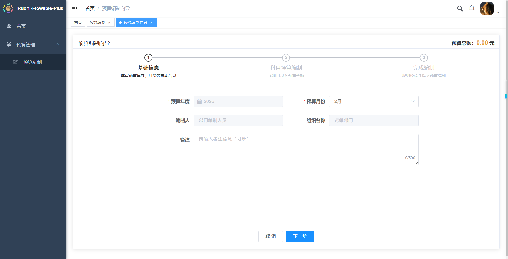
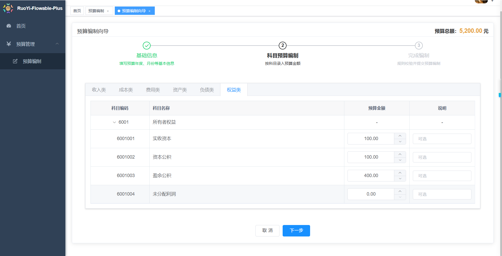
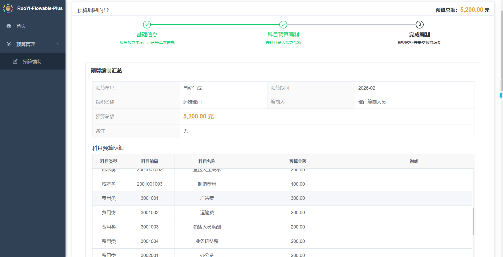
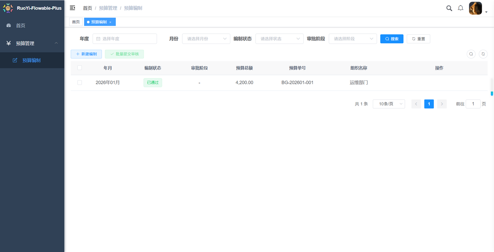
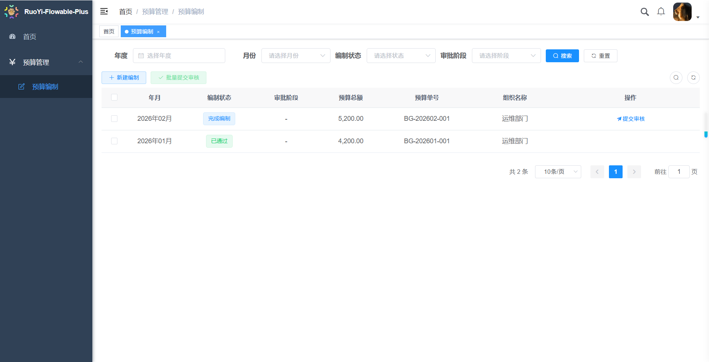
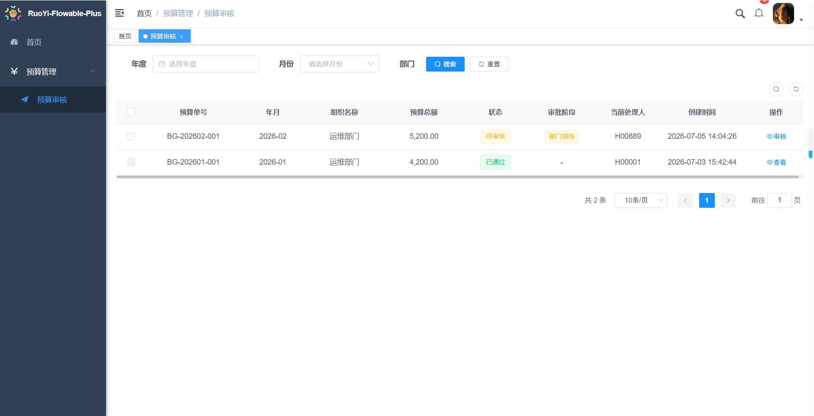
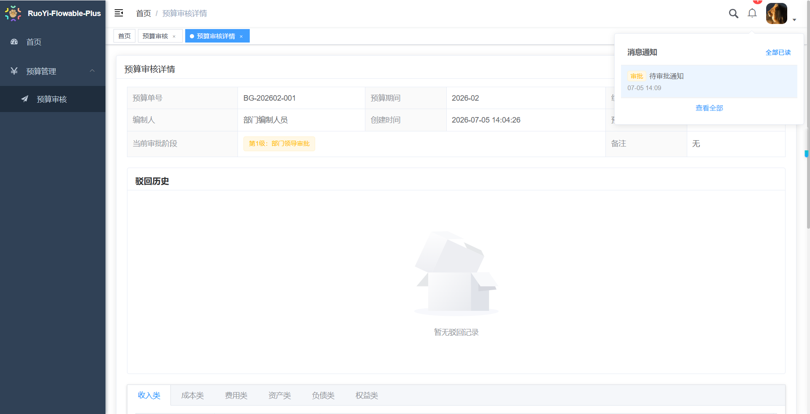
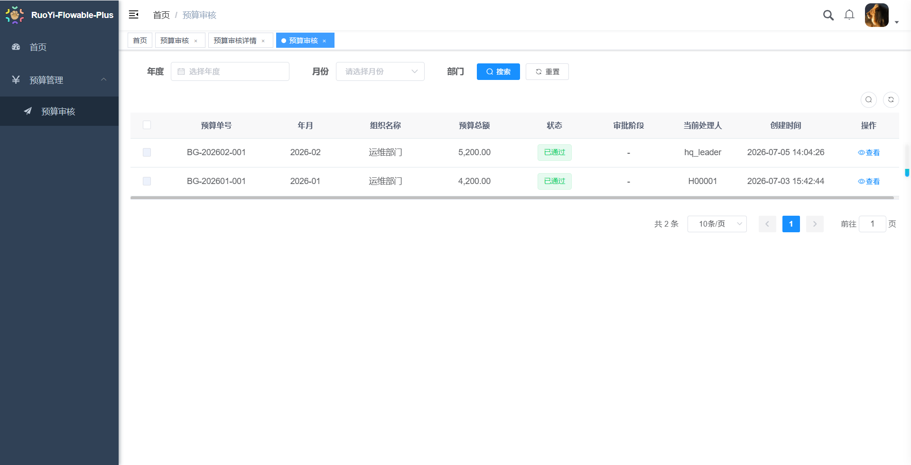
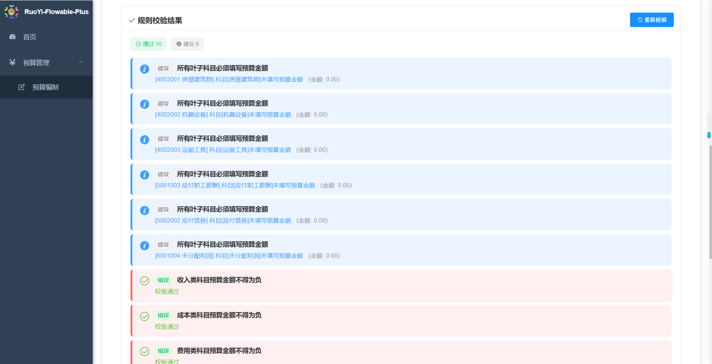
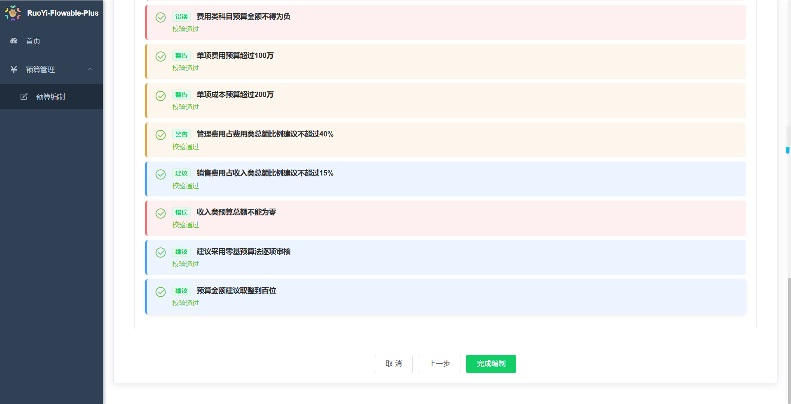

# RuoYi-Flowable-Budget 企业全面预算管理系统

## 项目简介

基于 RuoYi-Flowable-Plus 二次开发的**企业级三级预算管理开源平台**，主打「上月实绩驱动下月预算」业务模式，适配总公司、分公司、部门三级组织架构，内置向导式编制、Flowable三级审批、智能风控、站内消息、邮件通知、AI预算分析助手全套能力，开箱即用，支持中小企业私有化部署与二次开发。

## 在线演示

> 演示地址：http://118.89.133.114/


### 测试账号（密码统一：123456）

| 角色 | 账号 | 权限说明 |
|------|------|---------|
| 部门预算编制人员 | H00889 | 仅可编制、修改本部门预算，提交审核 |
| 部门经理 | H00998 | 一级审批，可通过/驳回部门预算单 |
| 分公司本部 | H00223 | 二级审批，可汇总编制、打回部门单据 |
| 总公司本部 | H00001 | 三级终审，审批通过后预算永久锁定只读 |
| 超级管理员 | admin | 系统全部配置、角色、菜单、数据权限管理 |

## 核心功能

### 1. 预算编制模块

1. 三步向导式编制：基础信息→科目明细→汇总确认
2. 6大类科目分Tab录入：收入/成本/费用/资产/负债/权益
3. 自动填充上月已审批预算数据，快速生成下月预算
4. 实时总额计算、千位金额格式化、同部门月度重复校验
5. 草稿可编辑删除、驳回单据可重新修改提交

**步骤 1：基础信息**



**步骤 2：科目预算编制**



**步骤 3：完成编制 / 汇总确认**



**预算编制列表（查询）**



**预算编制列表（提交审核）**



### 2. 三级流程审批（Flowable工作流）

> 完整审批链路：部门经理 → 分公司本部 → 总公司本部

1. 单条/批量审批，驳回强制填写5-500字以内理由
2. 任意层级驳回直接退回编制人员，留存完整驳回历史
3. 总公司终审通过后流程终止，预算单据全局只读，不可修改删除
4. 精准角色权限校验，非当前审批人仅可查看，无操作按钮

**部门经理审批列表（一级审批）**



**预算审核详情（审批阶段 + 消息通知铃铛）**



**总公司终审列表（三级审批）**



### 3. 智能风控规则引擎

内置 11 条可动态配置风控校验规则，分 3 种严重等级：

- **ERROR**（阻断提交）：科目必填、收入成本费用金额不能为负、收入总额不能为 0
- **WARNING**（黄色预警）：单项费用/成本超阈值、管理费用占比超标
- **INFO**（蓝色建议）：零基预算提示、金额取整建议

**规则校验结果（建议项）**



**规则校验结果（警告 + 建议项）**



### 4. 消息通知体系

1. 站内消息：导航栏铃铛角标，待审批、驳回实时推送，一键跳转单据
2. 邮件通知：编制期提醒、待审批通知、驳回通知、审批通过、超时告警定时推送

### 5. AI 智能预算助手

1. 自动读取当前预算单表头+明细数据，做差异、科目汇总分析
2. 流式对话SSE逐字输出，支持20轮多轮上下文记忆
3. 自动生成预算报表摘要、流程答疑、编制优化建议
4. 可通过配置开关 `ai.enabled` 一键开启/关闭

### 6. 安全与权限体系

1. 角色分级数据权限：全辖/分公司/本部门/仅本人数据隔离
2. 金额敏感数据脱敏、页面水印、全量操作日志追溯
3. Sa-Token 登录鉴权，菜单、按钮、接口三级权限控制

## 技术栈

### 后端

- 核心框架：SpringBoot 2.7.x + RuoYi-Vue 多模块架构
- 工作流：Flowable 6.x 审批引擎
- AI能力：DashScope 通义大模型、OkHttp 流式对话
- 数据库：MySQL 8.0
- 中间件：Redis、Quartz定时任务
- 工具：MyBatis-Plus、Sa-Token、Mail邮件服务

### 前端

- Vue2 + Element UI
- Axios 接口封装、SSE流式AI对话、路由权限控制

## 项目目录说明

```
ruoyi-flowable-budget-demo
├── docs              # 需求文档、部署手册、业务操作手册
├── script            # 数据库初始化 SQL、流程部署脚本
├── ruoyi-admin       # 项目启动入口
├── ruoyi-ai          # AI 智能助手模块
├── ruoyi-flowable    # Flowable 工作流封装
├── ruoyi-job         # 定时任务（邮件定时提醒）
├── ruoyi-system      # 预算编制、审批、消息核心业务模块
├── ruoyi-ui          # Vue 前端工程
├── app.ps1           # Windows 一键启停服务脚本
├── pom.xml           # 项目依赖管理
```

## 公网演示（内网穿透）

使用 cpolar 映射本地 8088 端口，生成公网可访问地址，教程见 docs 部署文档。

## 版本更新记录

### v1.0 (2026-07-05)

- 完整三级预算编制 + Flowable 三级审批流程
- 11 条内置智能风控校验规则
- 站内消息铃铛、全场景邮件通知定时任务
- AI 智能预算分析助手（流式多轮对话）
- 完整需求说明书、数据库脚本、一键启停脚本

## 开源协议

MIT License

- 可免费用于个人学习、中小企业商用，保留项目开源声明
- 如需定制开发、私有化部署、功能二开，可联系作者

## 联系方式

- 作者微信：`15026747184`
- 支持：部署指导、功能定制、流程二次开发、企业私有化交付

## 仓库地址

- GitHub：https://github.com/alfred224-82/ruoyi-flowable-budget-demo
- GitEE：https://gitee.com/alfred_224/ruoyi-flowable-budget-demo/tree/master
---

> 如果你觉得项目有用，欢迎 Star ⭐ 支持！有 Bug、功能需求可提交 Issues，我会持续迭代维护。
