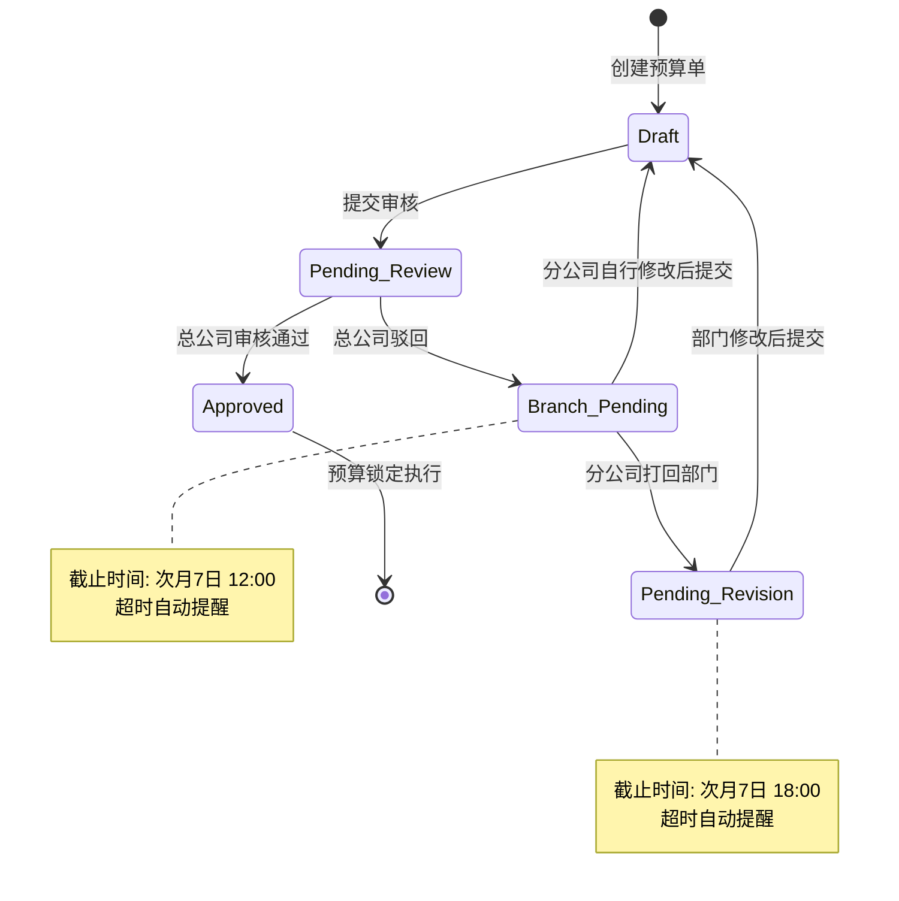
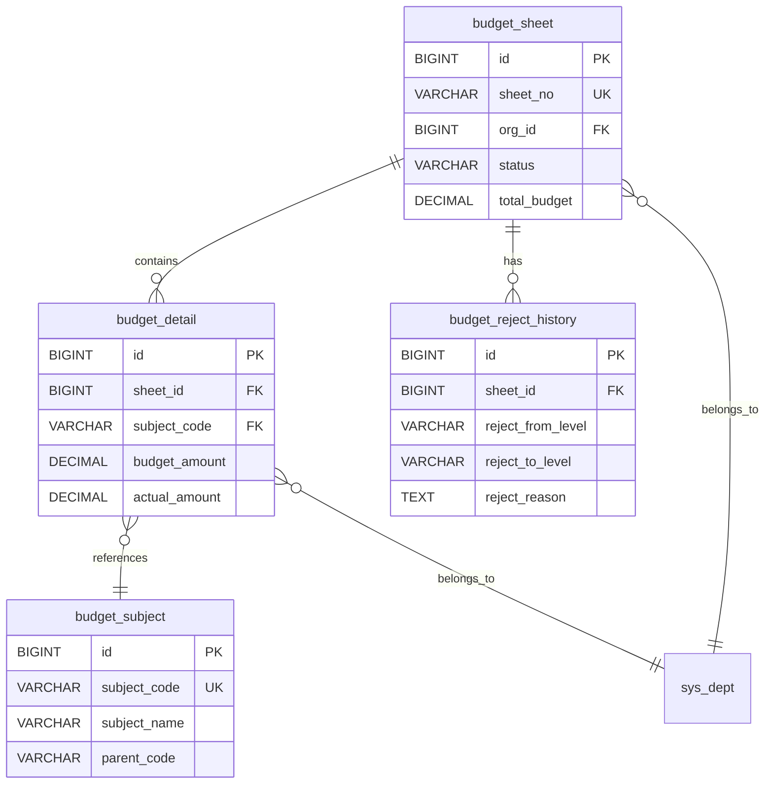
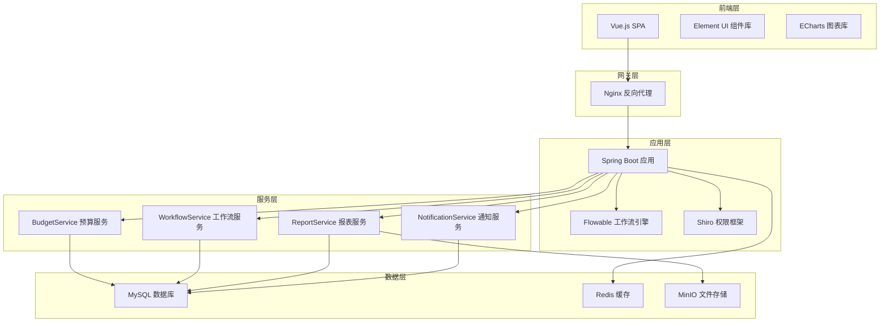

# 企业全面预算管理系统 - 需求规格说明书

**版本**：v9.0  
**更新日期**：2026-05-28  
**项目类型**：基于 RuoYi-Flowable-Plus 框架的企业级预算管理解决方案  
**适用对象**：产品经理、开发团队、测试团队、项目经理

---

## 目录

- [一、项目概述](#一项目概述)
- [二、核心业务逻辑](#二核心业务逻辑)
- [三、核心功能需求](#三核心功能需求)
- [四、数据架构设计](#四数据架构设计)
- [五、技术架构](#五技术架构)
- [六、接口设计规范](#六接口设计规范)
- [七、开发里程碑](#七开发里程碑)
- [八、附录](#八附录)

---
## 一、项目概述

### 1.1 项目背景

本系统是基于 RuoYi-Flowable-Plus 框架开发的企业级全面预算管理平台，旨在实现企业多层级预算编制、审核、执行的全流程数字化管理。系统采用「上月实绩驱动下月预算」的核心业务模式，支持总公司、分公司、部门三级组织架构的协同工作。

### 1.2 核心价值

- **流程自动化**：通过 Flowable 工作流引擎实现预算审批流程自动化
- **多级管控**：支持总公司→分公司→部门的多层级预算管控体系
- **智能风控**：内置风控规则引擎，自动识别异常数据
- **数据可视化**：提供丰富的报表和图表展示能力
- **安全合规**：敏感数据脱敏、操作日志追溯、水印保护

### 1.3 技术栈

| 层级 | 技术选型 |
|------|----------|
| 前端框架 | Vue.js + Element UI |
| 后端框架 | Spring Boot 2.5 + MyBatis Plus |
| 工作流引擎 | Flowable 6.x |
| 权限管理 | Apache Shiro / Sa-Token |
| 数据库 | MySQL 8.0+ |
| 缓存 | Redis |
| 消息通知 | JavaMail + Quartz |
| 文档处理 | Apache POI + iText |

---

## 二、核心业务逻辑
### 2.1 财务周期与核心规则

系统遵循「上月实绩驱动下月预算」模式，核心时间节点如下：

| 阶段 | 时间范围 | 核心动作 | 责任主体 |
|------|----------|----------|----------|
| 编制期 | 本月 26 日 - 次月 3 日 | 部门编制 → 分公司汇总 → 提交总公司 | 部门编制人员、分公司编制人员 |
| 总公司审核期 | 次月 5 日 - 次月 6 日 | 全辖预算审核 | 总公司审核员 |
| 分公司处理期 | 次月 7 日 00:00 - 12:00 | 处理总公司驳回 / 自行修改 | 分公司编制人员 |
| 部门重编期 | 次月 7 日 12:00 - 18:00 | 接收分公司打回后重新编制 | 部门编制人员 |
| 执行期 | 次月 8 日 00:00 起 | 预算锁定，正式执行 | 系统自动 |

> **重要说明**：实际财务数据（Actuals）为敏感数据，仅特定模块可见，全系统默认屏蔽。

#### 财务周期时序图


### 2.2 权限模型（核心）

#### 2.2.1 角色权限矩阵

| 角色 / 组织 | 编制权限 | 审核权限 | 对账单查看 | 打回权限 | 数据可见范围 |
|------------|---------|---------|-----------|---------|-------------|
| 总公司本部 | 全辖编制 | 全辖审批 | ✅ 可见 | 可打回至分公司本部 | 全辖数据 |
| 分公司本部 | 分公司汇总编制 | 分公司审批 | ✅ 可见 | 可打回至部门 / 自行重编 | 分公司及下属部门数据 |
| 部门编制人员 | 本部门编制 | ❌ 无 | ❌ 不可见 | ❌ 仅接收打回任务 | 本部门数据（实际金额脱敏） |
| 部门经理 | ❌ 无 | 本部门审批 | ❌ 不可见 | ❌ 无 | 本部门数据（实际金额脱敏） |

#### 2.2.2 数据权限规则

- **总公司视角**：可查看全辖所有预算数据及实际财务数据
- **分公司视角**：仅可查看本公司及下属部门数据，实际财务数据部分脱敏
- **部门视角**：仅可查看本部门数据，实际财务数据完全脱敏（显示为 `***`）

### 2.3 多级打回核心流程

#### 2.3.1 总公司驳回分公司流程

**触发条件**：
- 总公司审核员在审核界面点击「驳回」按钮
- 必须填写驳回理由（从预设理由库选择或手动输入）
- 默认打回至分公司本部

**系统行为**：
1. 单据状态变更为 `Branch_Pending`（分公司待处理）
2. 记录驳回历史到 `budget_reject_history` 表
3. 自动发送邮件通知分公司编制员和经理
   - 邮件包含：驳回理由、截止时间（次月 7 日 12:00）、操作链接
4. 启动截止时间倒计时监控

**分公司可选操作**：
- **选项① 自行修改**：在汇总层调整后直接重新提交总公司
- **选项② 打回部门**：指定具体部门并填写详细驳回理由

#### 2.3.2 分公司打回部门流程

**触发条件**：
- 分公司在「分公司待处理」状态下点击「打回至部门」
- 必须选择目标部门并填写驳回理由

**系统行为**：
1. 单据状态变更为 `Pending_Revision`（待重新编制）
2. 记录驳回历史到 `budget_reject_history` 表
3. 自动发送邮件通知部门编制员和经理
   - 邮件包含：驳回理由、截止时间（次月 7 日 18:00）、操作链接
4. 启动截止时间倒计时监控

**部门操作**：
- 在截止时间前完成数据修改并提交
- 提交后状态变为 `Pending_Review`（待审核）
- 分公司再次汇总后提报总公司

#### 2.3.3 流程状态流转图


## 三、核心功能需求

### 3.1 预算编制模块（状态流转）

#### 3.1.1 状态定义

| 状态码 | 状态名称 | 颜色标识 | 流转规则 | 可操作角色 |
|--------|---------|---------|---------|-----------|
| `Draft` | 草稿 | 🟢 绿色 | 可编辑；部门重编/分公司修改后回到此状态，提交后变为「待审核」 | 编制人员 |
| `Pending_Review` | 待审核 | 🔵 蓝色 | 提交后等待总公司审核；通过则锁定，驳回则变为「分公司待处理」 | 总公司审核员 |
| `Branch_Pending` | 分公司待处理 | 🟠 橙色 | 总公司驳回后状态；分公司可自行修改（回草稿）或打回部门（变「待重新编制」） | 分公司编制人员 |
| `Pending_Revision` | 待重新编制 | 🟡 黄色 | 分公司打回部门后状态；部门修改后回草稿 | 部门编制人员 |
| `Approved` | 审核通过 | ⚫ 灰色 | 总公司批准，预算锁定进入执行期，不可再修改 | 只读 |

#### 3.1.2 界面规范

**分公司视图（Branch_Pending 状态）**：
- 顶部红色警告条：显示「总公司已驳回，请在 **次月 7 日 12:00** 前处理」
- 驳回理由区域（只读）：展示总公司填写的驳回理由，支持展开/收起
- 操作按钮区：
  - 「自行修改」按钮：进入编辑模式，修改后可直接提交总公司
  - 「打回部门」按钮：弹出部门选择器，选择后填写理由并确认
- 倒计时组件：实时显示剩余时间（小时:分钟:秒），最后 2 小时标红闪烁

**部门视图（Pending_Revision 状态）**：
- 顶部红色警告条：显示「分公司已打回，请在 **次月 7 日 18:00** 前完成修改」
- 驳回理由区域（只读）：展示分公司填写的详细驳回理由
- 修改表单：可编辑的预算明细表格，支持批量修改
- 操作按钮区：
  - 「保存草稿」按钮：临时保存，不改变状态
  - 「提交审核」按钮：提交后状态变为 `Pending_Review`
- 倒计时组件：实时显示剩余时间，最后 1 小时标红闪烁

#### 3.1.3 状态机实现要点

- 使用 Flowable 工作流引擎管理状态流转
- 每个状态转换必须记录操作人、操作时间、操作 IP
- 超时未处理自动发送提醒邮件（提前 4 小时、提前 1 小时、超时即刻）
- 禁止逆向流转（如 `Approved` → `Draft`）

### 3.2 智能审核与风控

#### 3.2.1 风控规则引擎

系统在审核时自动执行以下校验规则，结果作为驳回理由参考（不干扰用户操作）：

| 规则类别 | 校验项 | 阈值/条件 | 风险提示等级 |
|---------|-------|----------|------------|
| 预算超标 | 部门预算 vs 上月实际 | 偏差 > ±20% | 🔴 高危 |
| 汇总逻辑 | 明细合计 vs 汇总金额 | 不相等 | 🔴 高危 |
| 科目归类 | 科目编码有效性 | 不存在于科目表 | 🟡 中危 |
| 关键指标 | 必填字段完整性 | 存在空值 | 🟡 中危 |
| 历史对比 | 本期 vs 上期同期 | 波动 > ±30% | 🟢 低危 |

#### 3.2.2 驳回理由库

支持管理员动态配置，预设核心理由如下：

**总公司层级（5 类）**：
1. 全辖超标：整体预算超出公司年度预算配额
2. 汇总逻辑错：分公司汇总数据与部门明细不一致
3. 科目归类不符：预算科目使用错误
4. 数据偏差超 ±20%：与上月实际数据偏差过大
5. 关键指标缺失：缺少必要的支撑材料或说明

**分公司层级（5 类）**：
1. 部门数据异常：某部门数据明显偏离正常范围
2. 科目错：预算科目选择错误
3. 计算错：公式计算错误或手工录入错误
4. 超配额：超出分公司分配给部门的预算配额
5. 缺支撑材料：缺少必要的附件或说明文档

#### 3.2.3 风控报告生成

审核时自动生成风控报告，包含：
- 触发的风控规则列表
- 每条规则的详细数据对比
- 风险等级评估（高/中/低）
- 建议操作（通过/驳回/需进一步核实）

### 3.3 报表系统

#### 3.3.1 导出规范

- **格式支持**：PDF、Excel（.xlsx）
- **水印要求**：
  - 文本内容：`机密 - [用户名] - [导出时间 YYYY-MM-DD HH:mm:ss]`
  - 位置：页面中心，45° 倾斜，透明度 30%
  - 字体：宋体，字号 24pt，颜色 #CCCCCC
- **权限控制**：仅授权角色可导出，操作记录日志

#### 3.3.2 核心报表清单

| 报表名称 | 数据粒度 | 筛选条件 | 图表类型 | 可见角色 |
|---------|---------|---------|---------|---------|
| 预算汇总表 | 组织层级 | 月份、组织、科目 | 柱状图、表格 | 总公司、分公司 |
| 预算明细表 | 科目层级 | 月份、部门、科目 | 表格 | 全部角色（数据脱敏） |
| 执行对比表 | 月度对比 | 月份、组织 | 折线图、差异率热力图 | 总公司、分公司 |
| 驳回记录统计表 | 驳回维度 | 时间段、组织、驳回方 | 饼图、表格 | 总公司、分公司 |
| 趋势分析表 | 历史趋势 | 近 12 个月 | 折线图、同比环比 | 总公司 |

#### 3.3.3 对账单模块

**访问权限**：仅总公司、分公司非编制人员可见

**功能特性**：
- **时间粒度**：年 / 季 / 月自由切换
- **钻取能力**：
  - 组织钻取：总公司 → 分公司 → 部门
  - 科目钻取：一级科目 → 二级科目 → 明细科目
- **可视化组件**：
  - 柱状图：预算 vs 实际对比
  - 折线图：月度趋势变化
  - 饼图：科目占比分布
  - 热力图：差异率分布（±15% 标红，±10% 标黄，±10% 以内标绿）
- **导出功能**：支持当前视图导出为 PDF/Excel

### 3.4 邮件通知系统

#### 3.4.1 邮件模板

**模板 1：总公司驳回通知**
```
主题：【预算驳回】您的预算单已被总公司驳回，请尽快处理

尊敬的 {receiver_name}：

您的预算单（编号：{sheet_no}）已被总公司驳回。

驳回理由：{reject_reason}
截止时间：{deadline_time}（次月 7 日 12:00）

请及时登录系统处理：{system_url}

如有疑问，请联系总公司财务部。

此邮件由系统自动发送，请勿回复。
```

**模板 2：分公司打回通知**
```
主题：【预算打回】您的预算单已被分公司打回，请重新编制

尊敬的 {receiver_name}：

您的预算单（编号：{sheet_no}）已被分公司打回。

打回理由：{reject_reason}
截止时间：{deadline_time}（次月 7 日 18:00）

请及时登录系统重新编制：{system_url}

如有疑问，请联系分公司财务部。

此邮件由系统自动发送，请勿回复。
```

**模板 3：超时提醒通知**
```
主题：【紧急提醒】您的预算单即将超时，请立即处理！

尊敬的 {receiver_name}：

您的预算单（编号：{sheet_no}）将在 {remaining_hours} 小时后超时。

当前状态：{current_status}
截止时间：{deadline_time}

请立即登录系统处理：{system_url}

超时后将影响后续流程，请务必重视！

此邮件由系统自动发送，请勿回复。
```

#### 3.4.2 发送策略

- **即时发送**：驳回/打回操作后立即发送
- **定时提醒**：截止时间前 4 小时、1 小时各发送一次提醒
- **超时告警**：超时后立即发送告警邮件给上级管理者
- **重试机制**：发送失败后重试 3 次，间隔 5 分钟，仍失败记录日志并告警

---
## 四、数据架构设计

### 4.1 核心表结构

#### 4.1.1 预算表头表（budget_sheet）

| 字段名 | 类型 | 说明 | 备注 |
|--------|------|------|------|
| id | BIGINT | 主键 ID | 自增 |
| sheet_no | VARCHAR(50) | 预算单号 | 唯一索引，格式：BG-YYYYMM-XXX |
| org_id | BIGINT | 组织 ID | 关联 sys_dept 表 |
| org_name | VARCHAR(100) | 组织名称 | 冗余字段，便于查询 |
| budget_month | VARCHAR(7) | 预算月份 | 格式：YYYY-MM |
| status | VARCHAR(20) | 状态码 | Draft/Pending_Review/Branch_Pending/Pending_Revision/Approved |
| reject_level | VARCHAR(10) | 驳回来源 | HQ/Branch/None |
| reject_reason | TEXT | 驳回理由 | 最新一次的驳回理由 |
| deadline_time | DATETIME | 截止时间 | 根据驳回层级自动计算 |
| current_handler | VARCHAR(50) | 当前处理人 | 用户工号 |
| total_budget | DECIMAL(18,2) | 预算总额 | 自动汇总明细表 |
| total_actual | DECIMAL(18,2) | 实际总额 | 脱敏后数据 |
| variance_rate | DECIMAL(5,2) | 差异率 | 自动计算：(预算-实际)/实际*100 |
| create_by | VARCHAR(50) | 创建人 | 用户工号 |
| create_time | DATETIME | 创建时间 | 自动填充 |
| update_by | VARCHAR(50) | 更新人 | 用户工号 |
| update_time | DATETIME | 更新时间 | 自动填充 |
| remark | VARCHAR(500) | 备注 |  |

**索引设计**：
- 主键索引：`PRIMARY KEY (id)`
- 唯一索引：`UNIQUE KEY uk_sheet_no (sheet_no)`
- 普通索引：`KEY idx_org_month (org_id, budget_month)`
- 普通索引：`KEY idx_status (status)`

#### 4.1.2 预算明细表（budget_detail）

| 字段名 | 类型 | 说明 | 备注 |
|--------|------|------|------|
| id | BIGINT | 主键 ID | 自增 |
| sheet_id | BIGINT | 表头 ID | 外键，关联 budget_sheet.id |
| subject_code | VARCHAR(20) | 科目编码 | 关联预算科目表 |
| subject_name | VARCHAR(100) | 科目名称 | 冗余字段 |
| budget_amount | DECIMAL(18,2) | 预算金额 |  |
| actual_amount | DECIMAL(18,2) | 实际金额 | 脱敏存储，查询时根据权限决定是否显示 |
| variance_amount | DECIMAL(18,2) | 差异金额 | 自动计算：预算-实际 |
| variance_rate | DECIMAL(5,2) | 差异率 | 自动计算：(预算-实际)/实际*100 |
| dept_id | BIGINT | 部门 ID | 关联 sys_dept 表 |
| dept_name | VARCHAR(100) | 部门名称 | 冗余字段 |
| sort_order | INT | 排序号 | 用于前端展示顺序 |
| create_time | DATETIME | 创建时间 | 自动填充 |
| update_time | DATETIME | 更新时间 | 自动填充 |

**索引设计**：
- 主键索引：`PRIMARY KEY (id)`
- 普通索引：`KEY idx_sheet_id (sheet_id)`
- 普通索引：`KEY idx_subject (subject_code)`

#### 4.1.3 驳回历史记录表（budget_reject_history）

| 字段名 | 类型 | 说明 | 备注 |
|--------|------|------|------|
| id | BIGINT | 主键 ID | 自增 |
| sheet_id | BIGINT | 预算单 ID | 外键，关联 budget_sheet.id |
| sheet_no | VARCHAR(50) | 预算单号 | 冗余字段 |
| reject_from_level | VARCHAR(10) | 驳回方层级 | HQ/Branch |
| reject_from_user | VARCHAR(50) | 驳回人工号 |  |
| reject_from_name | VARCHAR(50) | 驳回人姓名 | 冗余字段 |
| reject_to_level | VARCHAR(10) | 被驳回方层级 | Branch/Dept |
| reject_to_user | VARCHAR(50) | 被驳回人工号 | 可为空（打回部门时） |
| reject_to_dept_id | BIGINT | 被驳回部门 ID | 打回部门时必填 |
| reject_to_dept_name | VARCHAR(100) | 被驳回部门名称 | 冗余字段 |
| reject_reason | TEXT | 驳回理由 |  |
| deadline_time | DATETIME | 截止时间 |  |
| reject_time | DATETIME | 驳回时间 | 自动填充 |
| handle_time | DATETIME | 处理时间 | 用户处理时的时间 |
| handle_duration_hours | DECIMAL(8,2) | 处理耗时（小时） | 自动计算 |
| is_timeout | TINYINT(1) | 是否超时 | 0-否，1-是 |

**索引设计**：
- 主键索引：`PRIMARY KEY (id)`
- 普通索引：`KEY idx_sheet_id (sheet_id)`
- 普通索引：`KEY idx_reject_time (reject_time)`

#### 4.1.4 预算科目表（budget_subject）

| 字段名 | 类型 | 说明 | 备注 |
|--------|------|------|------|
| id | BIGINT | 主键 ID | 自增 |
| subject_code | VARCHAR(20) | 科目编码 | 唯一索引 |
| subject_name | VARCHAR(100) | 科目名称 |  |
| parent_code | VARCHAR(20) | 父级科目编码 | 顶级为 NULL |
| level | INT | 科目层级 | 1/2/3 |
| is_leaf | TINYINT(1) | 是否叶子节点 | 0-否，1-是 |
| sort_order | INT | 排序号 |  |
| is_active | TINYINT(1) | 是否启用 | 0-禁用，1-启用 |

### 4.2 数据脱敏规则

| 数据字段 | 总公司可见 | 分公司可见 | 部门可见 |
|---------|-----------|-----------|---------|
| budget_amount | 完整显示 | 完整显示 | 完整显示 |
| actual_amount | 完整显示 | 脱敏显示（保留小数位，整数位显示 `***`） | 完全脱敏（显示 `***`） |
| variance_rate | 完整显示 | 完整显示 | 隐藏 |

**脱敏实现**：
- 后端根据当前用户角色动态处理数据
- 前端不存储原始数据，仅接收后端返回的脱敏后数据
- 导出报表时同样应用脱敏规则

### 4.3 ER 关系图



---

## 五、技术架构

### 5.1 系统架构图



### 5.2 核心技术选型说明

#### 5.2.1 Flowable 工作流引擎

**选型理由**：
- 原生支持 BPMN 2.0 标准
- 与 Spring Boot 无缝集成
- 提供完整的流程实例管理 API
- 支持流程版本控制和历史追溯

**应用场景**：
- 预算审批流程管理
- 状态流转控制
- 流程历史查询
- 超时任务监控

#### 5.2.2 权限控制方案

**双层权限模型**：
1. **功能权限**：基于 Shiro/Sa-Token 的角色权限控制
   - 菜单权限：控制用户可见菜单
   - 按钮权限：控制页面操作按钮
   - 接口权限：控制 API 访问

2. **数据权限**：基于注解的数据范围控制
   - `@DataScope` 注解自动注入数据过滤条件
   - 根据用户所属组织自动限制数据范围
   - 支持自定义数据权限规则

### 5.3 性能优化策略

| 优化点 | 方案 | 预期效果 |
|--------|------|---------|
| 数据库查询 | 添加合理索引、避免 N+1 查询 | 查询响应 < 500ms |
| 缓存策略 | Redis 缓存热点数据（科目表、组织树） | 减少 DB 压力 60% |
| 分页查询 | MyBatis Plus 分页插件 + 物理分页 | 大数据量查询稳定 |
| 异步处理 | 邮件发送、报表生成异步执行 | 接口响应 < 2s |
| 文件导出 | 流式写入，避免内存溢出 | 支持万级数据导出 |

---

## 六、接口设计规范

### 6.1 RESTful API 规范

**统一响应格式**：
```json
{
  "code": 200,
  "msg": "操作成功",
  "data": {}
}
```

**状态码定义**：
- `200`：成功
- `400`：请求参数错误
- `401`：未认证
- `403`：无权限
- `500`：服务器内部错误

### 6.2 核心接口清单

#### 6.2.1 预算编制接口

| 接口路径 | 方法 | 说明 | 权限要求 |
|---------|------|------|---------|
| `/budget/sheet/list` | GET | 分页查询预算单列表 | 全部角色 |
| `/budget/sheet/{id}` | GET | 查询预算单详情 | 全部角色（数据脱敏） |
| `/budget/sheet` | POST | 创建预算单 | 编制人员 |
| `/budget/sheet/{id}` | PUT | 更新预算单 | 编制人员（仅 Draft 状态） |
| `/budget/sheet/{id}/submit` | POST | 提交审核 | 编制人员 |
| `/budget/sheet/{id}/approve` | POST | 审核通过 | 总公司审核员 |
| `/budget/sheet/{id}/reject` | POST | 驳回 | 总公司审核员 |
| `/budget/sheet/{id}/send-back` | POST | 打回部门 | 分公司编制人员 |

#### 6.2.2 报表接口

| 接口路径 | 方法 | 说明 | 权限要求 |
|---------|------|------|---------|
| `/budget/report/summary` | GET | 预算汇总报表 | 总公司、分公司 |
| `/budget/report/detail` | GET | 预算明细报表 | 全部角色（数据脱敏） |
| `/budget/report/execution` | GET | 执行对比报表 | 总公司、分公司 |
| `/budget/report/export` | POST | 导出报表 | 授权角色 |

#### 6.2.3 驳回历史接口

| 接口路径 | 方法 | 说明 | 权限要求 |
|---------|------|------|---------|
| `/budget/reject/history/{sheetId}` | GET | 查询驳回历史 | 相关处理人 |
| `/budget/reject/reasons` | GET | 获取驳回理由库 | 审核员 |

### 6.3 接口示例

**提交审核接口**：
```http
POST /budget/sheet/123/submit
Content-Type: application/json
Authorization: Bearer {token}

Response:
{
  "code": 200,
  "msg": "提交成功",
  "data": {
    "sheetNo": "BG-202605-001",
    "status": "Pending_Review",
    "submitTime": "2026-05-30 10:30:00"
  }
}
```

**驳回接口**：
```http
POST /budget/sheet/123/reject
Content-Type: application/json
Authorization: Bearer {token}

{
  "rejectReason": "汇总数据虚高，请核实",
  "rejectReasonCode": "HQ_001"
}

Response:
{
  "code": 200,
  "msg": "驳回成功",
  "data": {
    "sheetNo": "BG-202605-001",
    "status": "Branch_Pending",
    "deadlineTime": "2026-06-07 12:00:00"
  }
}
```

---

## 七、开发里程碑
### 7.1 开发计划总览

| 周期 | 核心目标 | 关键交付物 | 验收标准 |
|------|---------|-----------|---------|
| Week 1 | 状态机 + 界面开发 | 1. Flowable 状态机后端实现<br>2. 驳回相关接口（8 个）<br>3. 分公司/部门视图前端开发<br>4. 状态流转单元测试 | 1. 状态流转准确率 100%<br>2. 接口覆盖率 ≥80%<br>3. 前端页面无报错 |
| Week 2 | 分级邮件通知 | 1. 邮件模板（3 类）<br>2. JavaMail 发送服务集成<br>3. 驳回理由库管理<br>4. 发送日志 + 重试机制 | 1. 邮件发送成功率 ≥99%<br>2. 重试机制有效<br>3. 日志完整可追溯 |
| Week 3 | 联调 + 全流程测试 | 1. 前后端接口联调<br>2. 权限测试用例执行<br>3. 边界场景验证（超时/多次驳回）<br>4. Bug 修复 | 1. 接口联调通过率 100%<br>2. 权限漏洞 0 个<br>3. P0/P1 Bug 全部修复 |
| Week 4 | 压测 + UAT | 1. 性能优化（响应 < 2 秒）<br>2. E2E 测试用例执行<br>3. UAT 验收（通过率≥95%）<br>4. 安全审计 + 部署文档 | 1. 并发用户 100+ 时响应 < 2s<br>2. UAT 通过率 ≥95%<br>3. 安全漏洞 0 个 |

### 7.2 详细任务分解

#### Week 1：状态机 + 界面开发

**后端任务**：
- [ ] 设计 Flowable BPMN 流程定义文件
- [ ] 实现状态机服务类 `BudgetStateMachineService`
- [ ] 开发预算单 CRUD 接口（8 个）
- [ ] 实现驳回/打回业务逻辑
- [ ] 编写单元测试（覆盖率 ≥80%）

**前端任务**：
- [ ] 设计分公司视图页面（红色警告条 + 操作按钮）
- [ ] 设计部门视图页面（倒计时组件 + 修改表单）
- [ ] 实现状态标签组件（不同颜色标识）
- [ ] 对接后端接口，完成数据绑定

**测试任务**：
- [ ] 编写状态流转测试用例（至少 10 个场景）
- [ ] 执行单元测试，修复失败用例

#### Week 2：分级邮件通知

**后端任务**：
- [ ] 设计邮件模板（3 类：驳回/打回/超时提醒）
- [ ] 集成 JavaMail 发送服务
- [ ] 实现邮件发送异步化（使用 `@Async`）
- [ ] 开发驳回理由库管理接口
- [ ] 实现发送日志记录和重试机制

**前端任务**：
- [ ] 开发驳回理由选择器组件
- [ ] 实现理由库管理页面（仅管理员可见）

**测试任务**：
- [ ] 测试邮件发送功能（正常/异常场景）
- [ ] 验证重试机制有效性
- [ ] 检查日志完整性

#### Week 3：联调 + 全流程测试

**联调任务**：
- [ ] 前后端接口联调（逐个接口验证）
- [ ] 修复接口对接问题
- [ ] 优化接口响应速度

**测试任务**：
- [ ] 执行权限测试用例（角色越权、数据越权）
- [ ] 验证边界场景：
  - 超时未处理自动提醒
  - 多次驳回流程正确性
  - 并发提交数据一致性
- [ ] 执行兼容性测试（Chrome/Firefox/Edge）
- [ ] 提交 Bug 清单并跟踪修复

#### Week 4：压测 + UAT

**性能优化任务**：
- [ ] 数据库慢查询优化（添加索引、优化 SQL）
- [ ] Redis 缓存热点数据
- [ ] 接口响应时间优化（目标 < 2s）
- [ ] 执行压力测试（JMeter，100 并发用户）

**UAT 任务**：
- [ ] 准备 UAT 测试环境
- [ ] 编写 UAT 测试手册
- [ ] 组织业务用户进行验收测试
- [ ] 收集反馈并优化

**交付任务**：
- [ ] 完成安全审计报告
- [ ] 编写部署文档
- [ ] 编写用户操作手册
- [ ] 打包发布生产版本

### 7.3 风险管理

| 风险项 | 概率 | 影响 | 应对措施 |
|--------|------|------|---------|
| Flowable 集成复杂度高 | 中 | 高 | 提前调研官方文档，预留缓冲时间 |
| 邮件发送失败率高 | 低 | 中 | 实现重试机制，配置备用 SMTP 服务器 |
| 性能不达标 | 中 | 高 | 早期进行性能测试，及时优化 |
| UAT 验收不通过 | 低 | 高 | 提前与业务用户沟通需求，中期演示确认 |

---

## 八、附录

### 8.1 术语表

| 术语 | 英文 | 说明 |
|------|------|------|
| HQ | Headquarters | 总公司本部 |
| Branch Office | Branch Office | 分公司本部 |
| Reject | Reject | 驳回（上级对下级） |
| Send Back | Send Back | 打回（同级或上级对下级） |
| Actuals | Actuals | 实绩数据（实际财务数据） |
| Budget Sheet | Budget Sheet | 预算单 |
| Variance Rate | Variance Rate | 差异率 |

### 8.2 参考资料

- [RuoYi-Flowable-Plus 官方文档](https://gitee.com/KonBAI-Q/ruoyi-flowable-plus)
- [Flowable 官方文档](https://www.flowable.com/open-source/docs)
- [Spring Boot 2.5 官方文档](https://spring.io/projects/spring-boot)
- [MyBatis Plus 官方文档](https://baomidou.com/)
- [Element UI 官方文档](https://element.eleme.cn/)

### 8.3 版本修订记录

| 版本 | 日期 | 修订内容 | 修订人 |
|------|------|---------|--------|
| v9.0 | 2026-05-28 | 1. 新增多级打回机制<br>2. 细化邮件通知功能<br>3. 增加二次分配权<br>4. 适配企业多层级预算管理诉求 | 产品团队 |
| v8.0 | 2026-04-15 | 初始版本，基础预算编制和审核功能 | 产品团队 |

### 8.4 审批签字

| 角色 | 姓名 | 签字 | 日期 |
|------|------|------|------|
| 产品经理 |  |  |  |
| 技术负责人 |  |  |  |
| 测试负责人 |  |  |  |
| 项目负责人 |  |  |  |

---

**文档结束**